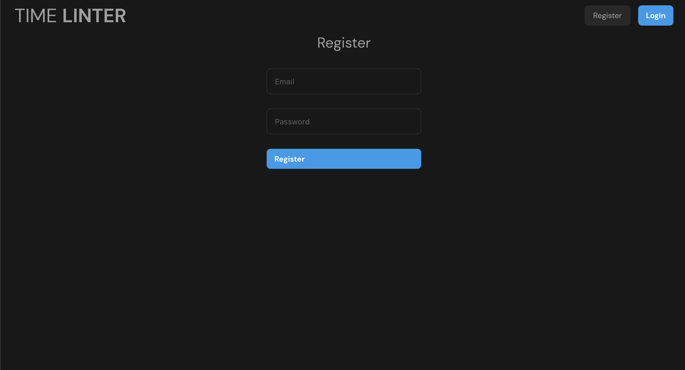
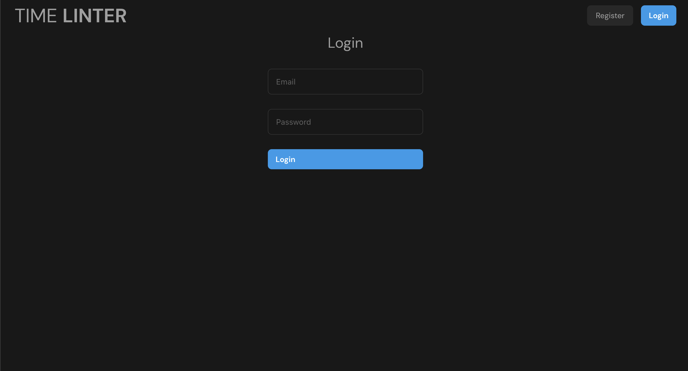
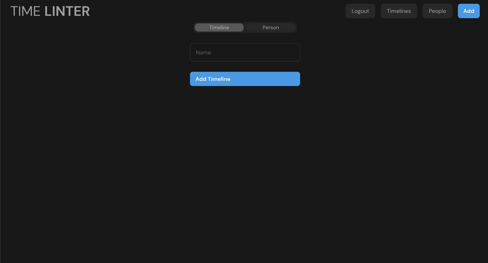
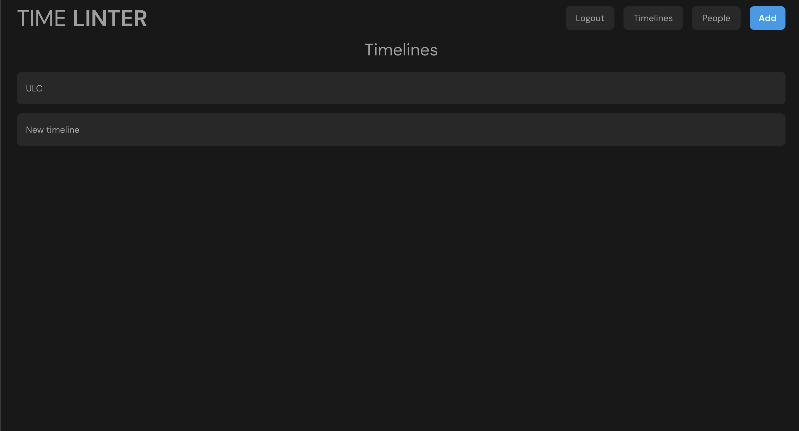
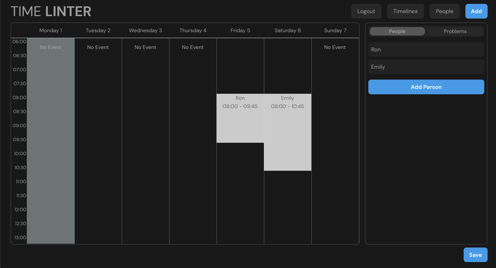
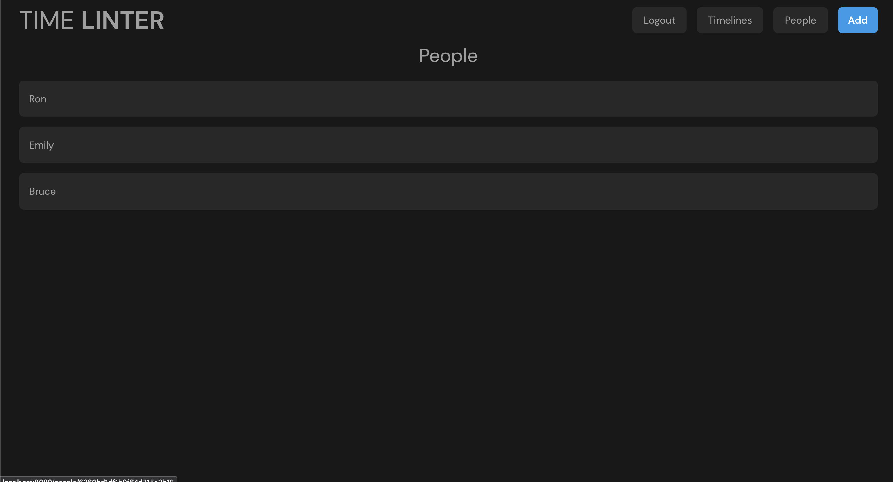
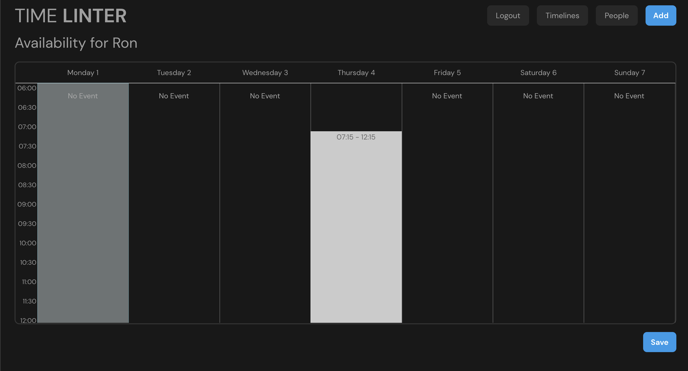
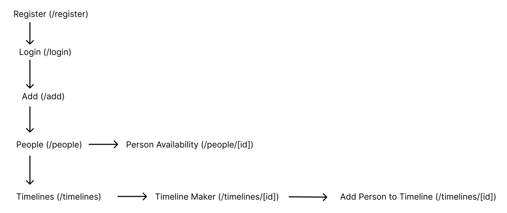

# Timelinter

## Overview

Making schedules for small teams is really difficult if there are contstraints on how the schedules can be laid out.

If there is a maximum number of people that can be on shift at one time, or if there is a maximum number of hours on payroll, things get really complicated. Timelinter is an attempt to fix that. It is a schedule maker that will complain if constraints are violated.

It's essentially a linter for schedules.

## Data Model

The application will store Users, Timelines, and People

-   users can have multiple timelines (by reference)
-   each timeline can have multiple people attatched to it (by reference)
-   each timeline will have multiple blocks assigned within it
-   users can have multiple people (by reference)
-   each person can have multiple "availabilty blocks" within in

An Example User:

```javascript
{
  username: "shannonshopper",
  password: // a password hash,
  timelines: // an array of references to Timeline documents
  people: // an array of references to Person documents
}
```

An Example Timeline:

```javascript
{
  user: // a reference to a User object
  name: "Tutoring",
  people: // an array of references to Person documents
  blocks: // an array of Block documents stored within the timeline
}
```

An Example Person:

```javascript
{
  name: "Alyssa P. Hacker"
  user: // a reference to a User object
  availability: // an array of Block documents stored within the timeline
}
```

An Example Block:

```javascript
{
  person: // a reference to a Person object (to whom this block belongs)
  startTime: // a JS Date object
  endTime: // a JS Date object
}
```

## [Database Schema](db.js)

## Wireframes

/register - for the user to register


/login - for the user to login


/add - page for creating timelines and people


/timelines - page for showing all timelines


/timeline/[id] - page for showing specific timeline


/people - page for showing all people


/people/[id] - page for showing specific timeline


## Site map



## User Stories or Use Cases

1. as non-registered user, I can register a new account with the site
2. as a user, I can log in to the site
3. as a user, I can add timelines to the site
4. as a user, I can add people to the site
5. as a user, I can add a person's availability to their record
6. as a user, I can add people to timelines; their availability will be shown when you click on them
7. as a user, I can add assigned blocks to people within timelines
8. As a user, I can see any problems (including blocks assigned outside people's availability)

This is a complicated project. To get familiar with it, I'd recommend following these steps:

1. Register
2. Login

3. Add timeline (in /add)
4. Add a few people (in /add)
5. Add availability to people (in /people/[id])
6. Add people to timeline (in /timeline/[id])

7. Add blocks to timeline by clicking on the person you want to assign those blocks
8. Look at the Problems tab to see if there are any people whose assigned blocks are outside availability

## Research Topics

-   (3 points) Integrate user authentication
    -   I'm going to be using passport for user authentication
    -   And account has been made for testing; the password will be in the form
-   (5 points)
    -   used vue.js as the frontend framework; it's a challenging library to learn, so I've assigned it 5 points

8 points total out of 8 required points

## [Link to Initial Main Project File](app.js)

## Annotations / References Used

[Nuxt.JS](https://v3.nuxtjs.org/)
[VueCal](https://antoniandre.github.io/vue-cal/#api)
[VueRouter](https://router.vuejs.org/)
